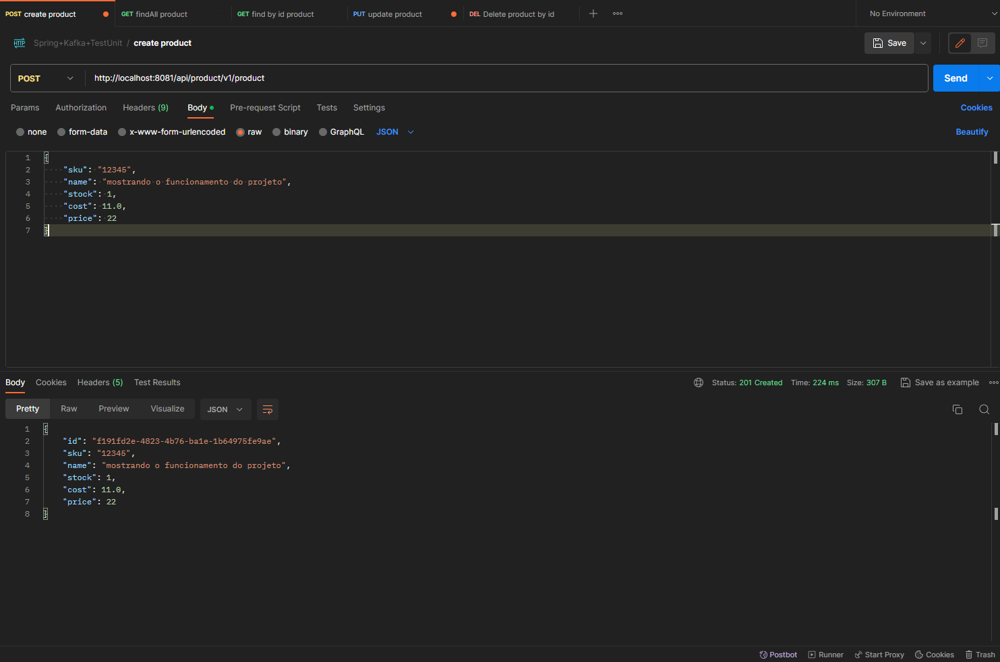
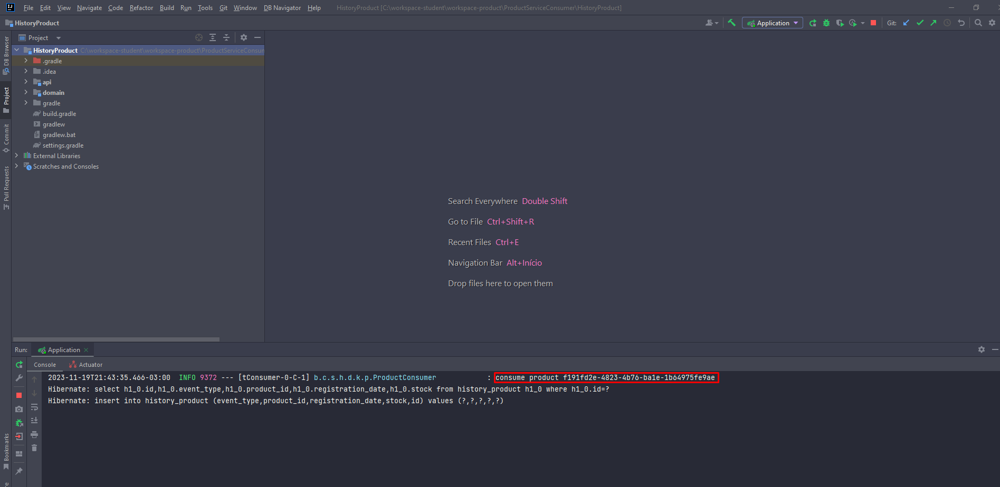
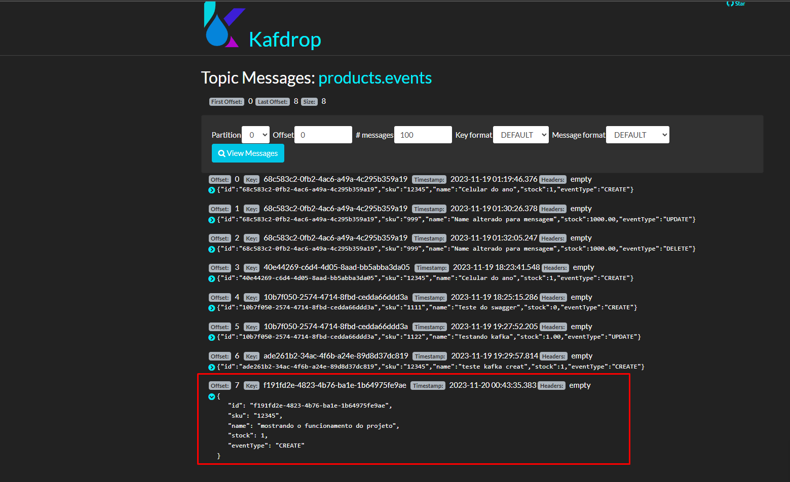
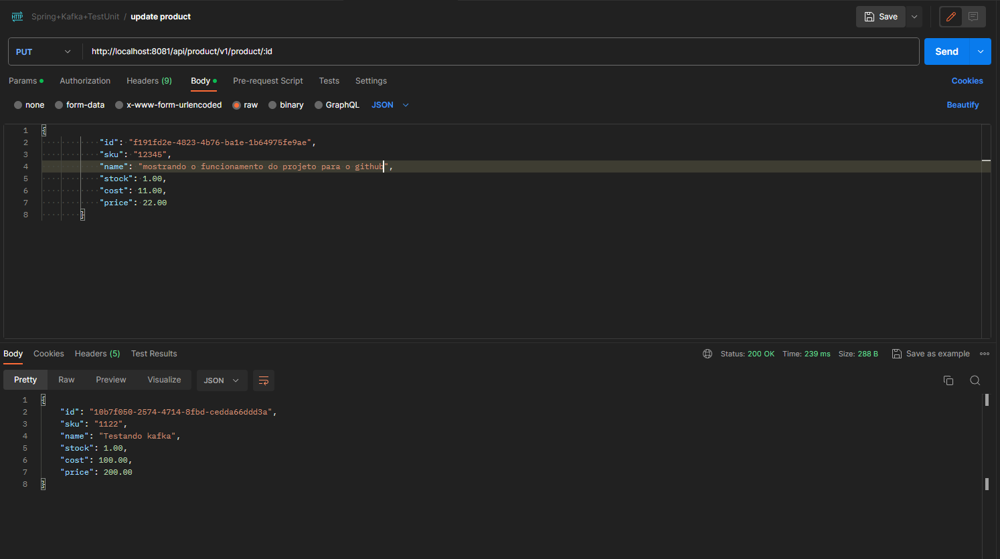
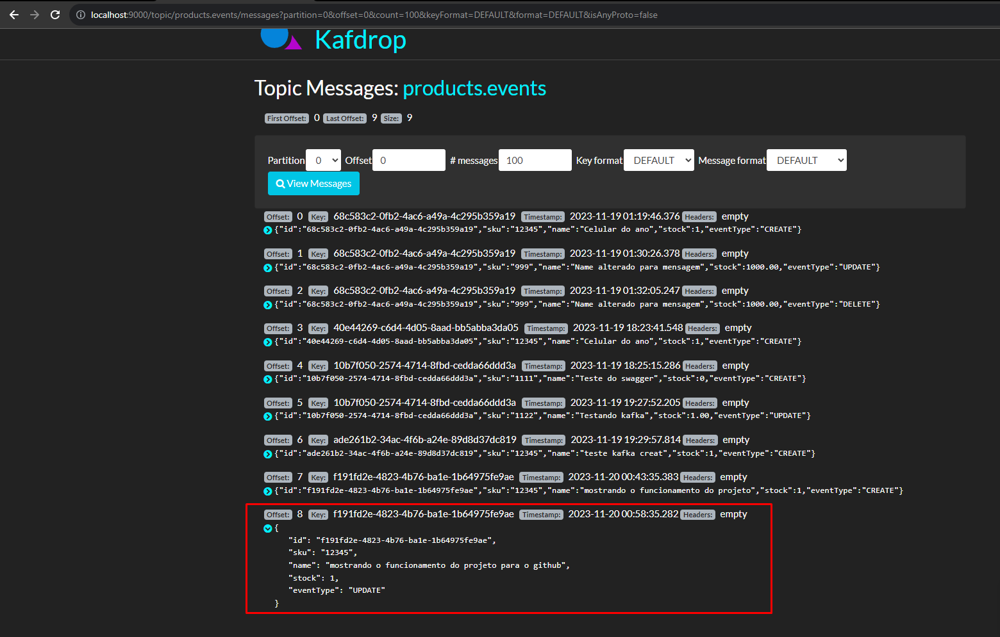
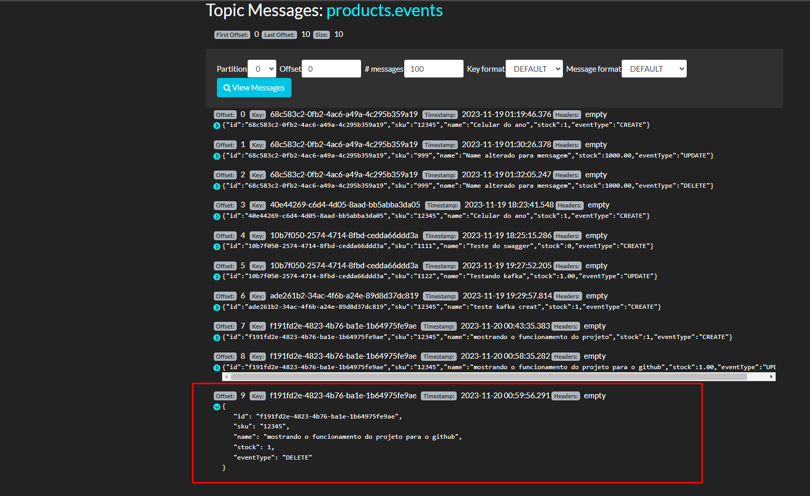

<h1 id="nome-do-projeto" align="center">Serviço de produtos</h1>

- 📈 [Sobre o projeto](#about)
- 🤖 [Tecnologias](#technologies)
- 🧑‍🔧[Dependências](#dependencies)
- 💻[Funcionamento](#operation)

<h2 id="about">📈 Sobre o projeto</h2> 

Este repositório contém uma aplicação que oferece operações HTTP padrão (GET, POST, DELETE, PUT) para manipulação de produtos. A aplicação interage com um banco de dados, permitindo a criação, listagem, atualização e exclusão de produtos.

Além disso, a cada ação de criação, atualização ou exclusão, a aplicação dispara uma mensagem em um tópico específico. Esse mecanismo foi desenvolvido para permitir que um projeto de histórico de produtos consuma e registre essas informações relevantes.

<h2 id="technologies">🤖 Tecnologias/ferramentas</h2>  

- **Java 17**
- **Intellij [IDE de sua preferência]**
- **MySql**
- **Postman**
- **Docker**
- **Kafdrop**

<h2 id="dependencies">🧑‍🔧 Dependências</h2>  

- **Spring Boot Starter Web**: É uma dependência que facilita a criação de aplicativos da web com o Spring MVC. Inclui configurações básicas e dependências para criar aplicativos web rapidamente.
- **Hibernate JPA**: Esta dependência facilita a utilização do JPA (Java Persistence API) para acesso a dados relacionais em aplicativos Spring Boot. Torna mais simples a configuração de repositórios JPA e o trabalho com bancos de dados relacionais.
- **Spring Kafka**: Fornece suporte para integração do Spring com o Apache Kafka. Permite a criação de produtores e consumidores Kafka de maneira simplificada com o Spring.
- **Flyway**: O Flyway permite que você versione e controle suas migrações de esquema de banco de dados de maneira controlada por código.
- **Springdoc OpenAPI**: É uma ferramenta que gera automaticamente documentação da API com base nos controladores RESTful do Spring Boot. Facilita a criação de documentação interativa da API usando o padrão OpenAPI (anteriormente conhecido como Swagger).
- **JUnit**: São bibliotecas de teste para Java.

<h2 id="operation">💻 Funcionamento do Projeto</h2>  

Enviando uma requisição para criar o produto, passando o payload e retornando 201 created.

Após criar o produto, é enviado uma mensagem via tópico utilizando o kafka para o projeto histórico de produtos, nesta imagem é um log consumindo a mensagem.

A mensagem no kafDrop

As operações http PUT e Delete funcionam de forma semelhante, após deletar ou atualizar é enviado a mensagem:

## 🤝 Perfil do dev

<table>
  <tr>
    <td align="center">
      <a href="https://www.linkedin.com/in/gabriel-mendes-3a668917b/">
         
        
          <b>Gabriel Mendes</b>
        
      </a>
    </td>
  </tr>
</table>

[⬆ Voltar ao topo](#nome-do-projeto)
